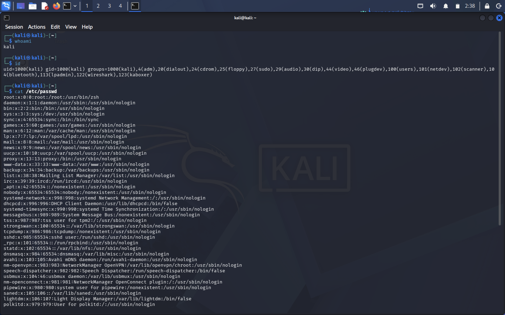
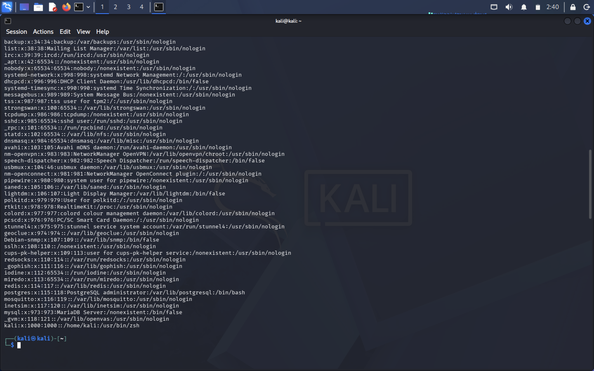
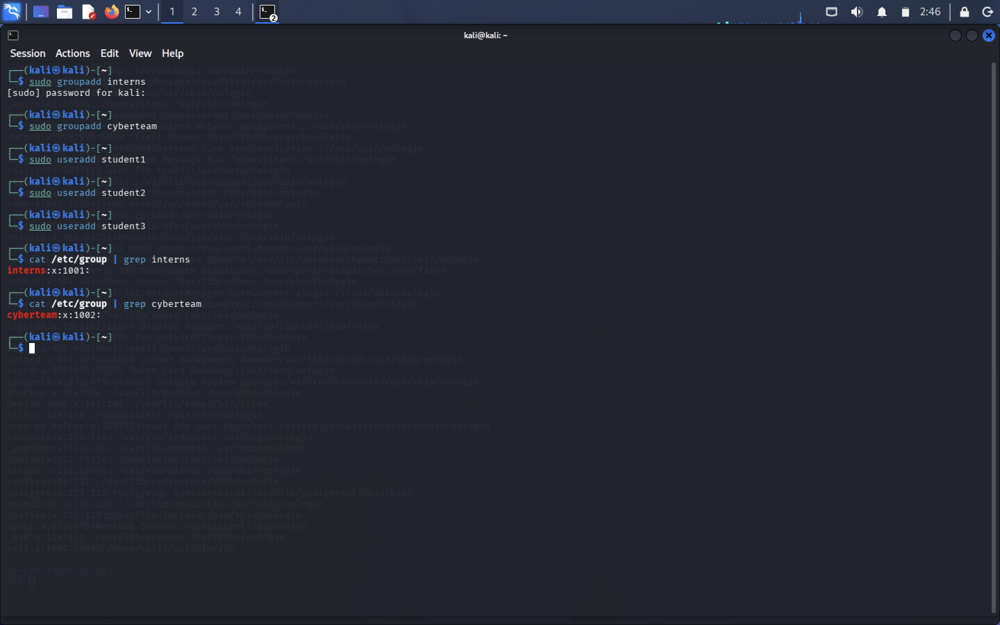
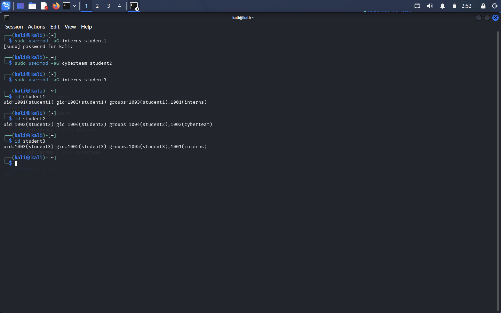
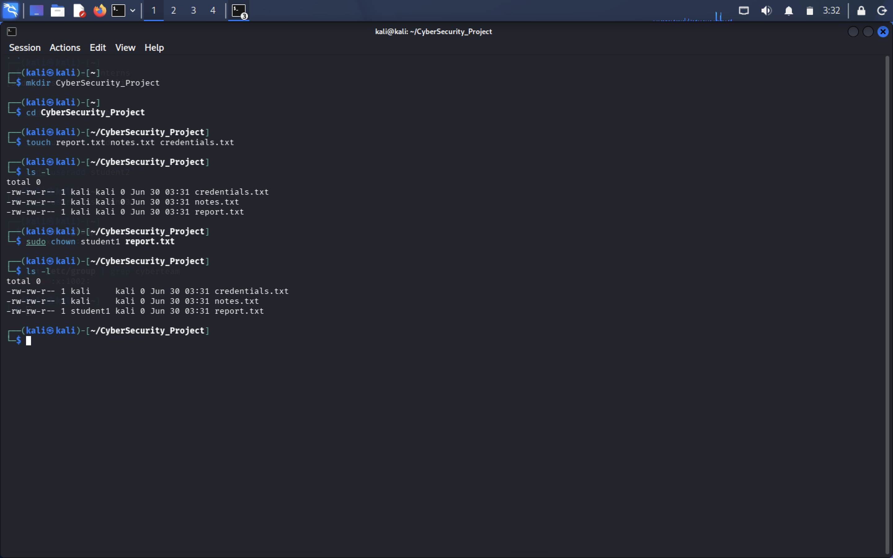
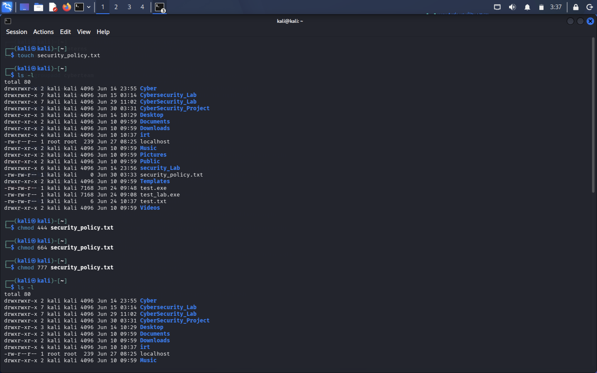
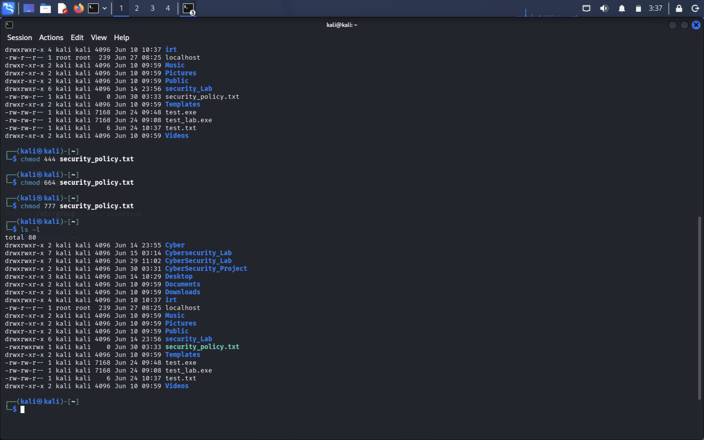

# Linux Task 02 – Users, Groups & File Permissions

# Project Overview

This project was completed as part of the **Linux Fundamentals Lab – Task 02**. The primary objective of this lab is to gain practical experience with Linux user management, group management, file ownership, and file permissions.

Linux is a multi-user operating system where multiple users can work on the same system simultaneously. To maintain system security and protect sensitive data, Linux provides a robust permission model that controls who can read, modify, or execute files and directories.

During this task, various Linux commands were used to create users and groups, assign users to groups, change file ownership, modify file permissions, and understand how permissions contribute to system security.

---

# Objectives

The objectives of this task are:

- Understand Linux user accounts and groups.
- Learn how Linux stores user information.
- Create new users and groups.
- Assign users to specific groups.
- Verify group memberships.
- Understand file ownership.
- Change ownership using the `chown` command.
- Modify file permissions using the `chmod` command.
- Analyze common Linux permission values.
- Understand the Principle of Least Privilege.
- Learn why proper permissions are important for Linux security.

---

# Part A – Understanding Linux Users

# Objective

The purpose of this section was to understand how Linux identifies users and stores user account information.

# Commands Used

```bash
whoami
id
cat /etc/passwd
```


# `whoami`

Displays the username of the currently logged-in user.

# `id`

Displays:

- User ID (UID)
- Group ID (GID)
- Secondary Groups

# `/etc/passwd`

This is one of the most important Linux system files. It stores information about every user account available on the system including:

- Username
- User ID (UID)
- Group ID (GID)
- Home Directory
- Default Login Shell

---


# Current Logged-in User



---

# User Information and `/etc/passwd`



---

# Part B – Creating Users and Groups

# Objective

Linux uses groups to organize users and simplify permission management. In this section, new groups and users were created and users were assigned to groups.

---

# Commands Used

```bash
sudo groupadd interns
sudo groupadd cyberteam

sudo useradd student1
sudo useradd student2
sudo useradd student3

sudo usermod -aG interns student1
sudo usermod -aG cyberteam student2
sudo usermod -aG interns student3

groups student1
groups student2
groups student3
```

---


# Creating Groups

Two groups were created:

- interns
- cyberteam

Groups make it easier to assign permissions to multiple users.

---

# Creating Users

Three new users were created:

- student1
- student2
- student3

---

# Assigning Groups

Users were assigned to their respective groups using the `usermod` command.

| User | Assigned Group |
|------|----------------|
| student1 | interns |
| student2 | cyberteam |
| student3 | interns |

---

# Verifying Membership

The `groups` command confirmed that each user was successfully added to the correct group.

---


# Creating Users and Groups



---

# Verifying Group Membership



---

# Part C – File Ownership

# Objective

Linux assigns every file an owner and a group. Ownership determines who can manage the file.

---

# Commands Used

```bash
mkdir CyberSecurity_Project

cd CyberSecurity_Project

touch report.txt
touch notes.txt
touch credentials.txt

ls -l

sudo chown student1 report.txt

ls -l
```

---

A project directory was created containing three files.

Initially, the files were owned by the current user.

The ownership of `report.txt` was changed to student1 using the `chown` command.

Finally, ownership was verified using:

```bash
ls -l
```

The output confirmed that the owner had changed successfully.

---




---

# Part D – Linux File Permissions

# Objective

Linux controls access to files using permissions.

Permissions determine whether users can:

- Read
- Write
- Execute

---

# Commands Used

```bash
touch security_policy.txt

chmod 444 security_policy.txt

chmod 664 security_policy.txt

chmod 777 security_policy.txt

ls -l
```

---

Different permission values were applied to understand how Linux controls access.

# 444

Read-only for everyone.

# 664

Owner and group can read/write.

Others can only read.

# 777

Everyone has complete access.

Although useful for testing, it is considered insecure in production systems.

---


# Changing Permissions



---

# Verifying Permissions



---

# Part E – Permission Analysis

| Permission | Owner | Group | Others | Typical Usage |
|------------|-------|-------|--------|--------------|
| 755 | rwx | r-x | r-x | Executable programs and directories |
| 644 | rw- | r-- | r-- | Text files and documents |
| 777 | rwx | rwx | rwx | Testing only (Not Recommended) |
| 600 | rw- | --- | --- | Passwords and private files |
| 700 | rwx | --- | --- | Personal scripts and directories |

---

# Part F – Security Challenge

| File | Recommended Permission | Reason |
|------|-----------------------|--------|
| password_backup.txt | 600 | Contains confidential passwords |
| public_notice.txt | 644 | Everyone should read but only owner should edit |
| system_log.txt | 640 | Only administrators and group members require access |
| personal_notes.txt | 600 | Personal information must remain private |

---

# Part G – Linux Security Research

# Why are file permissions important?

Linux file permissions prevent unauthorized users from accessing or modifying files. They help maintain confidentiality, integrity, and availability of system resources.

---

# What happens if sensitive files have 777 permissions?

When a file has **777 permissions**, every user can:

- Read the file
- Modify the file
- Execute the file

This creates serious security risks such as unauthorized modifications, malware execution, accidental deletion, and information leakage.

---

# Principle of Least Privilege 

The Principle of Least Privilege (PoLP) states that every user should receive only the minimum permissions necessary to perform their tasks.

This minimizes security risks and prevents unauthorized access.

---

# Why do organizations restrict user permissions?

Organizations restrict permissions to:

- Protect sensitive information
- Prevent unauthorized access
- Reduce insider threats
- Maintain system integrity
- Improve cybersecurity

---


# Linux Commands Used

- whoami
- id
- cat /etc/passwd
- groupadd
- useradd
- usermod
- groups
- mkdir
- touch
- ls -l
- chown
- chmod

---


